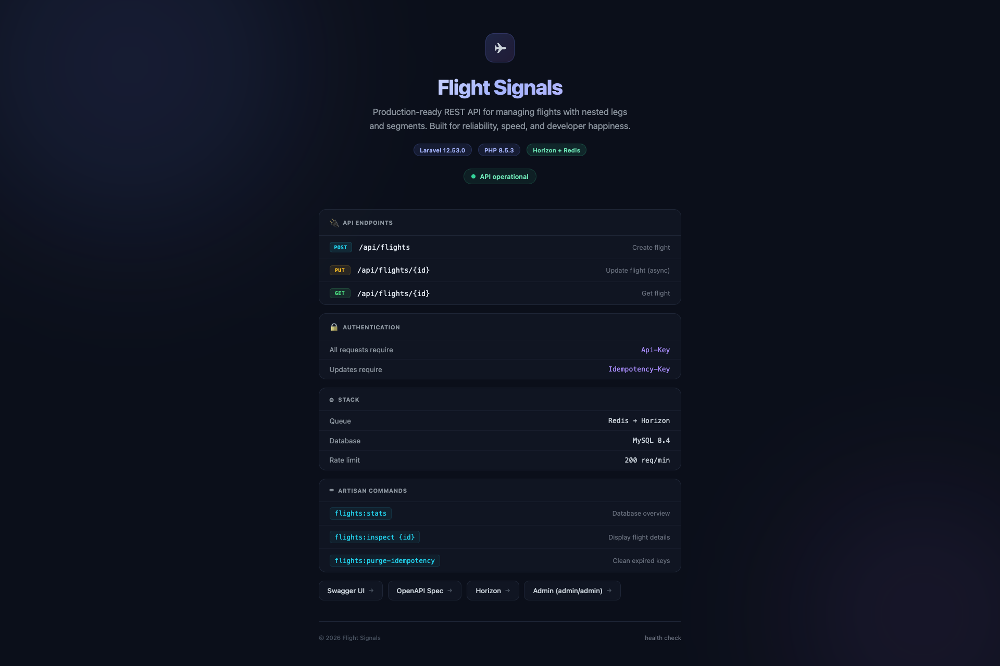
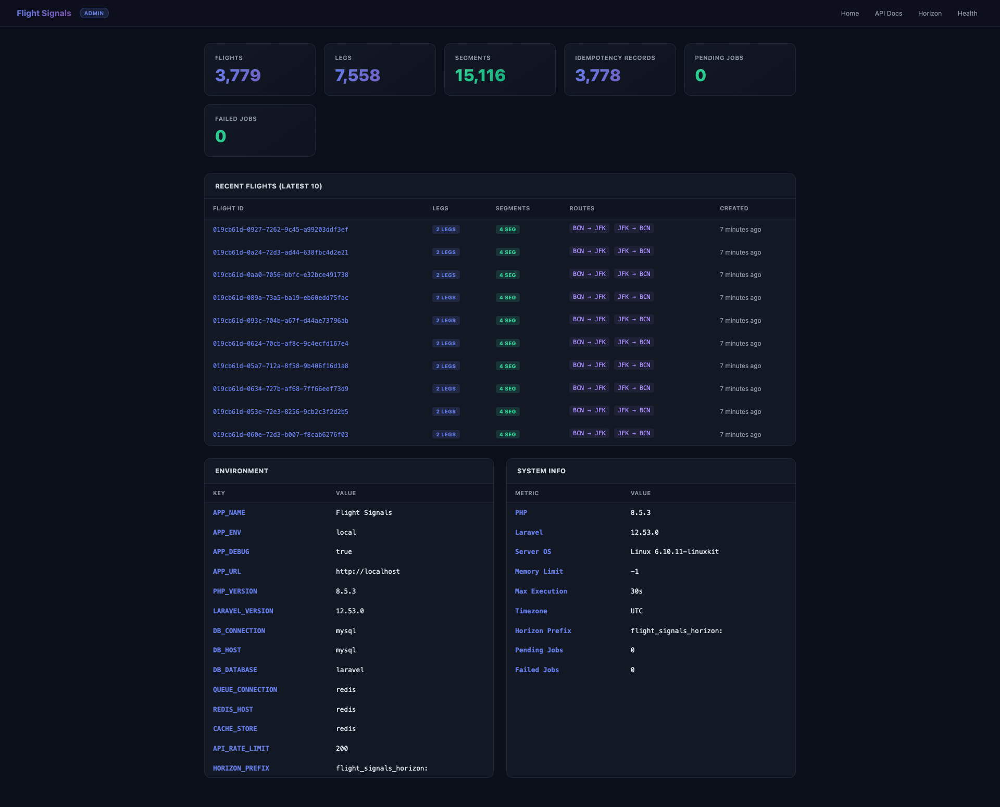
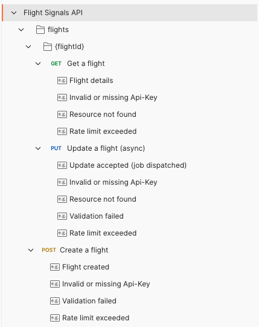
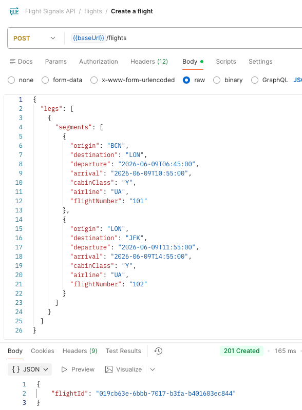
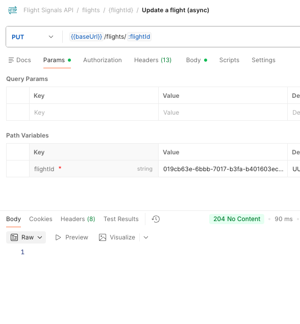
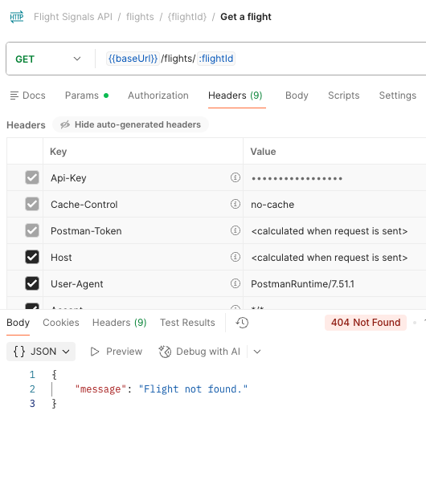
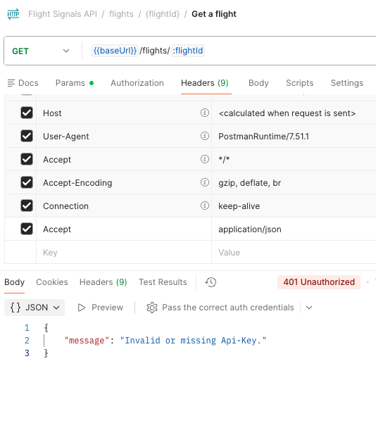

<h1 align="center">
  Flight Signals API
</h1>

<p align="center">
  A production-ready REST API for managing flights with nested legs and segments.<br>
  Built with <strong>Laravel 12</strong>, <strong>Horizon</strong>, <strong>Redis</strong>, and <strong>MySQL</strong>.
</p>

<p align="center">
  <a href="https://github.com/khaledalam/flight-signals/actions/workflows/ci.yml"></a>
  = 8.5">
  
  
  
  
  
</p>

<p align="center">
  <a href="#quickstart">Quickstart</a> &middot;
  <a href="#api-endpoints">API</a> &middot;
  <a href="#admin-dashboard">Admin</a> &middot;
  <a href="#testing">Testing</a> &middot;
  <a href="#performance--load-testing">Performance</a> &middot;
  <a href="#architecture">Architecture</a>
</p>

<br>

<p align="center">
  
  
</p>

---

## Features

| | |
|---|---|
| **3 API endpoints** | Create, Update (async), and Get flights with nested legs & segments |
| **Idempotent updates** | `Idempotency-Key` header guarantees exactly-once processing |
| **Async queue** | Updates dispatched to Redis, processed by Horizon workers |
| **API key auth** | All endpoints protected via `Api-Key` header |
| **Rate limiting** | Configurable per-key throttle (default 200 req/min) |
| **Admin dashboard** | Stats, flights, env & system info at `/admin` |
| **OpenAPI 3.0** | Interactive Swagger UI at `/docs` |
| **57 Pest tests** | Unit, feature, architecture, performance (100% coverage) |
| **k6 load tests** | Smoke, load, and spike scenarios |

---

## Quickstart

> **Prerequisites:** [Docker Desktop](https://www.docker.com/products/docker-desktop/) and [Composer](https://getcomposer.org/)

```bash
git clone https://github.com/khaledalam/flight-signals.git && cd flight-signals
composer install
cp .env.example .env
php artisan key:generate

# With Make
make up        # Start app + MySQL + Redis + Horizon
make migrate   # Run migrations

# Without Make
./vendor/bin/sail up -d
./vendor/bin/sail artisan migrate
```

The API is now live at **http://localhost:8080**.

> The port is controlled by `APP_PORT` in `.env` (default: `8080`).

| Service | URL | Auth |
|---------|-----|------|
| Homepage | http://localhost:8080 | -- |
| API | http://localhost:8080/api/flights | `Api-Key` header |
| Swagger UI | http://localhost:8080/docs | -- |
| Admin Dashboard | http://localhost:8080/admin | `ADMIN_USERNAME` / `ADMIN_PASSWORD` (basic auth) |
| Horizon | http://localhost:8080/horizon | `ADMIN_USERNAME` / `ADMIN_PASSWORD` (basic auth) |
| Health check | http://localhost:8080/up | -- |

<details>
<summary><strong>Shut down</strong></summary>

```bash
make down
# or
./vendor/bin/sail down
```

</details>

---

## API Endpoints

| Method | Path | Description | Auth | Status |
|--------|------|-------------|------|--------|
| `POST` | `/api/flights` | Create a flight | `Api-Key` | `201` |
| `PUT` | `/api/flights/{flightId}` | Update a flight (async) | `Api-Key` + `Idempotency-Key` | `204` |
| `GET` | `/api/flights/{flightId}` | Get a flight | `Api-Key` | `200` |

Interactive Swagger UI at **http://localhost:8080/docs** &middot; OpenAPI spec at [`openapi/openapi.json`](openapi/openapi.json)

**Postman:** Import `openapi/openapi.json` via File &rarr; Import to get the full collection.

<p align="center">
  
</p>

<details>
<summary><strong>Postman screenshots</strong></summary>
<br>

| Create Flight (`201`) | Update Flight (`204`) |
|:---:|:---:|
|  |  |

| Flight Not Found (`404`) | Missing Api-Key (`401`) |
|:---:|:---:|
|  |  |

</details>

<details>
<summary><strong>POST /api/flights</strong> -- Create a flight (full example with 2 legs)</summary>

```bash
curl -s -X POST http://localhost:8080/api/flights \
  -H "Content-Type: application/json" \
  -H "Api-Key: your-secret-api-key-here" \
  -d '{
    "legs": [{
      "segments": [{
        "origin": "BCN", "destination": "LON",
        "departure": "2026-06-09T06:45:00", "arrival": "2026-06-09T10:55:00",
        "cabinClass": "Y", "airline": "UA", "flightNumber": "101"
      }, {
        "origin": "LON", "destination": "JFK",
        "departure": "2026-06-09T11:55:00", "arrival": "2026-06-09T14:55:00",
        "cabinClass": "Y", "airline": "UA", "flightNumber": "102"
      }]
    }, {
      "segments": [{
        "origin": "JFK", "destination": "LON",
        "departure": "2026-06-25T06:45:00", "arrival": "2026-06-25T10:55:00",
        "cabinClass": "Y", "airline": "UA", "flightNumber": "101"
      }, {
        "origin": "LON", "destination": "BCN",
        "departure": "2026-06-25T11:55:00", "arrival": "2026-06-25T13:55:00",
        "cabinClass": "Y", "airline": "UA", "flightNumber": "102"
      }]
    }]
  }' | jq .
```

Response `201`:
```json
{ "flightId": "019cb527-4564-73da-b8c2-65b369738eda" }
```

</details>

<details>
<summary><strong>PUT /api/flights/{flightId}</strong> -- Update a flight (partial -- first leg only)</summary>

```bash
curl -s -X PUT http://localhost:8080/api/flights/019cb527-4564-73da-b8c2-65b369738eda \
  -H "Content-Type: application/json" \
  -H "Api-Key: your-secret-api-key-here" \
  -H "Idempotency-Key: $(uuidgen)" \
  -d '{
    "legs": [{
      "segments": [{
        "origin": "BCN", "destination": "LON",
        "departure": "2026-06-09T06:40:00", "arrival": "2026-06-09T10:50:00",
        "cabinClass": "Y", "airline": "UA", "flightNumber": "101"
      }, {
        "origin": "LON", "destination": "JFK",
        "departure": "2026-06-09T11:55:00", "arrival": "2026-06-09T14:55:00",
        "cabinClass": "Y", "airline": "UA", "flightNumber": "102"
      }]
    }]
  }'
```

Response: `204 No Content`

</details>

<details>
<summary><strong>GET /api/flights/{flightId}</strong> -- Get a flight</summary>

```bash
curl -s http://localhost:8080/api/flights/019cb527-4564-73da-b8c2-65b369738eda \
  -H "Api-Key: your-secret-api-key-here" | jq .
```

Response `200`:
```json
{
  "legs": [{
    "segments": [{
      "origin": "BCN", "destination": "LON",
      "departure": "2026-06-09T06:40:00", "arrival": "2026-06-09T10:50:00",
      "cabinClass": "Y", "airline": "UA", "flightNumber": "101"
    }, {
      "origin": "LON", "destination": "JFK",
      "departure": "2026-06-09T11:55:00", "arrival": "2026-06-09T14:55:00",
      "cabinClass": "Y", "airline": "UA", "flightNumber": "102"
    }]
  }, {
    "segments": [{
      "origin": "JFK", "destination": "LON",
      "departure": "2026-06-25T06:45:00", "arrival": "2026-06-25T10:55:00",
      "cabinClass": "Y", "airline": "UA", "flightNumber": "101"
    }, {
      "origin": "LON", "destination": "BCN",
      "departure": "2026-06-25T11:55:00", "arrival": "2026-06-25T13:55:00",
      "cabinClass": "Y", "airline": "UA", "flightNumber": "102"
    }]
  }]
}
```

</details>

---

## Idempotency & Rate Limiting

**Idempotency** -- The `PUT /api/flights/{flightId}` endpoint requires an `Idempotency-Key` header. The system guarantees exactly-once processing:

1. The request takes an atomic Redis lock (`Cache::lock()`) on the key, scoped to the flight.
2. First request -- update job dispatched, `204` response stored in Redis with a TTL (`IDEMPOTENCY_TTL`, default 24h). No database table, so nothing to purge.
3. Replay with same key -- stored `204` returned immediately, no duplicate job.
4. Same key while the first request still holds the lock -- `409 Conflict`.
5. Same key with a different payload -- `422`.
6. If the job permanently fails, the key is released so the client can retry with it.

## Validation

Segment times are **local to each airport** (`YYYY-MM-DDTHH:MM:SS`, no offset). Origin/destination must be a known IATA airport or metro code (`resources/data/airport-timezones.php`), which is used to convert both times to UTC before comparing:

- a segment must arrive after it departs (e.g. `SYD 10:00 -> LAX 06:00` same date is valid; `JFK 06:45 -> LHR 10:55` is not),
- each segment must depart after the previous segment of its leg arrives,
- each leg must depart after the previous leg arrives,
- origin and destination must differ,
- at most 10 legs per flight and 8 segments per leg. Oversized payloads are rejected before per-segment validation runs.

On update, every leg in the payload must match an existing leg by route (otherwise `422`), and the merged itinerary must still be in order.

**Rate Limiting** -- All API endpoints are throttled to **200 req/min** per `Api-Key` (configurable via `API_RATE_LIMIT`). Exceeding the limit returns `429 Too Many Requests`.

---

## Admin Dashboard

<p align="center">
  
</p>

| | |
|---|---|
| **URL** | `/admin` |
| **Username** | `ADMIN_USERNAME` env var |
| **Password** | `ADMIN_PASSWORD` env var |

Both `/admin` and `/horizon` are locked until these are set.

The dashboard displays:

- **Stats** -- flights, legs, segments, pending/failed jobs
- **Recent flights** -- last 10 with route summary and timestamps
- **Environment** -- app config, database, queue, cache, rate limit
- **System info** -- PHP/Laravel version, OS, memory limits, timezone, Horizon prefix

---

## Testing

88 [Pest](https://pestphp.com/) tests with **100% code coverage**, stable under `--parallel`. Tests use SQLite in-memory -- no Docker needed.

```bash
composer test              # Run all tests
composer test:coverage     # With coverage report
composer test:perf         # Performance tests only
make test                  # Via Sail
make cover                 # Coverage via Sail
```

<details>
<summary><strong>Test suites breakdown</strong></summary>

| Suite | Tests | Covers |
|-------|-------|--------|
| `RouteSignatureTest` | 5 | Route signature building, ordering, edge cases |
| `FlightServiceTest` | 7 | Create, positions, camelCase mapping, partial update, one-to-one leg matching |
| `UpdateFlightJobTest` | 3 | Flight-not-found early return, processing, key released on failure |
| `AdminServiceTest` | 4 | Dashboard stats, recent flights, job counts, env |
| `HorizonGateTest` | 4 | Basic auth required, wrong credentials, gate backstop |
| `AdminDashboardTest` | 6 | Env-based credentials, no `admin:admin`, locked when unconfigured |
| `AuthenticationTest` | 4 | Missing/invalid Api-Key, unconfigured key fails closed |
| `CreateFlightTest` | 6 | Happy path, validation errors, data persistence |
| `GetFlightTest` | 3 | Retrieval, 404 for unknown and malformed ids |
| `UpdateFlightTest` | 5 | Job dispatch, 204 response, actual data update, validation |
| `ItineraryValidationTest` | 19 | Segment/leg sequence, timezone-aware times, airport codes, size caps, update matching |
| `IdempotencyTest` | 7 | Replay, lock conflict (409), payload mismatch, per-flight scope, retry after failure |
| `CommandsTest` | 4 | flights:stats, flights:inspect |
| `RateLimitingTest` | 1 | 429 after exceeding threshold |
| `PerformanceTest` | 6 | Endpoint latency budgets, P95 regression, large payloads, write-free replays |
| `ArchitectureTest` | 4 | Layer boundaries (controllers, models, jobs, services) |

</details>

---

## Performance & Load Testing

### Latency budgets (Pest)

| Endpoint | Budget | Checks |
|----------|--------|--------|
| `POST /api/flights` | < 200ms | Single create + 50-request sustained throughput (avg + P95) |
| `GET /api/flights/{id}` | < 100ms | Normal + 10-leg/30-segment large payload |
| `PUT /api/flights/{id}` | < 200ms | Dispatch latency; replays do no DB writes and dispatch no job |

### k6 load testing

Three scenarios in `tests/Load/k6-flights.js`:

| Scenario | VUs | Duration | Purpose |
|----------|-----|----------|---------|
| **Smoke** | 1 | 10s | Sanity check, baseline latency |
| **Load** | 0 &rarr; 10 &rarr; 0 | 50s | Moderate sustained concurrency |
| **Spike** | 0 &rarr; 30 &rarr; 0 | 20s | Sudden burst handling |

```bash
brew install k6             # Install k6
make load                   # All scenarios (auto-adjusts rate limit)
make load-smoke             # Quick smoke test (1 VU, 10s)
```

> `make load` sets `API_RATE_LIMIT=10000` before running and restores `200` when done.

<details>
<summary><strong>Sample k6 output</strong></summary>

```
╔══════════════════════════════════════════════╗
║        Flight Signals -- Load Test Report    ║
╚══════════════════════════════════════════════╝

  Create P95           142.3ms
  Create P99           287.1ms
  Get P95              28.4ms
  Get P99              61.2ms
  Update P95           95.7ms
  Update P99           183.4ms
  Error Rate           0.00%
  Flights Created      847
```

</details>

---

## Architecture

```
┌─────────┐     ┌─────────────┐     ┌──────────────┐     ┌───────┐
│  Client │────▶│  Middleware │────▶│  Controller  │────▶│ MySQL │
│         │     │  (Api-Key)  │     │              │     └───────┘
└─────────┘     │  (Throttle) │     │  ┌────────┐  │
                └─────────────┘     │  │Service │  │     ┌───────┐
                                    │  └────┬───┘  │────▶│ Redis │
                                    │       │      │     └───┬───┘
                                    └───────┼──────┘         │
                                            │           ┌────▼────┐
                                            │           │ Horizon │
                                            │           │  Worker │
                                            │           └────┬────┘
                                            └────────────────┘
                                            (UpdateFlightJob)
```

<details>
<summary><strong>Key design decisions</strong></summary>

**Data model:** `Flight → Legs → Segments` with positional ordering. Flights use UUIDs.

**Leg matching on update:** Legs are matched by **route signature** -- the ordered `origin→destination` chain of segments (e.g., `BCN>LON|LON>JFK`). This allows partial updates while correctly identifying which leg to modify.

**Async updates:** The update endpoint validates input synchronously, takes a Redis idempotency lock, then dispatches an `UpdateFlightJob` to Redis. The job runs in Horizon with 3 retries and exponential backoff (5s, 30s, 60s). The flight row is locked (`SELECT ... FOR UPDATE`) while a job applies its changes, so concurrent updates are serialised.

**Thin controllers:** Controllers handle HTTP concerns only. Business logic lives in `FlightService`.

</details>

---

## Artisan Commands

```bash
make shell                  # Shell into the container
# or: ./vendor/bin/sail shell
```

<details>
<summary><strong><code>flights:stats</code></strong> -- Database overview</summary>

```bash
$ sail artisan flights:stats

  INFO  Flight Signals -- Database Stats.

+---------------------+----------------+
| Metric              | Value          |
+---------------------+----------------+
| Flights             | 1              |
| Legs                | 2              |
| Segments            | 4              |
| Avg legs/flight     | 2              |
| Avg segments/leg    | 2              |
| Last created        | 27 minutes ago |
+---------------------+----------------+
```

</details>

<details>
<summary><strong><code>flights:inspect {id}</code></strong> -- Display a flight</summary>

```bash
$ sail artisan flights:inspect 019cb527-4564-73da-b8c2-65b369738eda

  INFO  Flight 019cb527-4564-73da-b8c2-65b369738eda.

  Created: 2026-03-03 19:22:55
  Updated: 2026-03-03 19:22:55

  Leg 1 ............................................ 2 segment(s)
+------+-----+------------------+------------------+--------+-------+
| From | To  | Departure        | Arrival          | Flight | Cabin |
+------+-----+------------------+------------------+--------+-------+
| BCN  | LON | 2026-06-09 06:40 | 2026-06-09 10:50 | UA 101 | Y     |
| LON  | JFK | 2026-06-09 11:55 | 2026-06-09 14:55 | UA 102 | Y     |
+------+-----+------------------+------------------+--------+-------+
  Leg 2 ............................................ 2 segment(s)
+------+-----+------------------+------------------+--------+-------+
| From | To  | Departure        | Arrival          | Flight | Cabin |
+------+-----+------------------+------------------+--------+-------+
| JFK  | LON | 2026-06-25 06:45 | 2026-06-25 10:55 | UA 101 | Y     |
| LON  | BCN | 2026-06-25 11:55 | 2026-06-25 13:55 | UA 102 | Y     |
+------+-----+------------------+------------------+--------+-------+
```

</details>

<details>
<summary><strong>Other useful commands</strong></summary>

```bash
sail artisan migrate              # Run migrations
sail artisan migrate:fresh        # Reset database
sail artisan horizon              # Start Horizon worker
sail artisan route:list           # Show all routes
sail artisan queue:failed         # List failed jobs
sail artisan queue:retry all      # Retry all failed jobs
```

</details>

---

## Environment Variables

| Variable | Description | Default |
|---|---|---|
| `APP_PORT` | Host port | `8080` |
| `API_KEY` | Secret for `Api-Key` header | `your-secret-api-key-here` |
| `DB_CONNECTION` | Database driver | `mysql` |
| `DB_HOST` | Database host | `mysql` |
| `DB_DATABASE` | Database name | `laravel` |
| `DB_USERNAME` | Database user | `sail` |
| `DB_PASSWORD` | Database password | `password` |
| `QUEUE_CONNECTION` | Queue driver | `redis` |
| `REDIS_HOST` | Redis host | `redis` |
| `API_RATE_LIMIT` | Max requests/min per key | `200` |

All variables are in `.env.example`. Never commit `.env`.

---

## Developer Experience

<details>
<summary><strong>Tooling</strong></summary>

| Tool | Purpose | Command |
|------|---------|---------|
| [Pint](https://laravel.com/docs/pint) | Code style | `composer fix` / `composer lint` |
| [Pest](https://pestphp.com/) | Testing + perf | `composer test` / `composer test:perf` |
| [k6](https://k6.io/) | Load testing | `make load` / `make load-smoke` |
| [Horizon](https://laravel.com/docs/horizon) | Queue dashboard | http://localhost:8080/horizon |
| [Swagger UI](https://swagger.io/tools/swagger-ui/) | API docs | http://localhost:8080/docs |
| Admin Dashboard | Stats, env, flights | http://localhost:8080/admin |
| Pre-commit hook | Auto-lint on commit | `bash scripts/install-hooks.sh` |

</details>

<details>
<summary><strong>Makefile targets</strong></summary>

```bash
make help       # Show all targets
make up         # Start services
make down       # Stop services
make fresh      # Rebuild + migrate
make test       # Run Pest via Sail
make cover      # Tests + coverage
make perf       # Performance tests + profiling
make profile    # All tests with slowest highlighted
make load       # k6 load test (all scenarios)
make load-smoke # k6 smoke test (1 VU, 10s)
make lint       # Check code style
make fix        # Auto-fix code style
make shell      # Shell into container
make logs       # Tail app logs
```

</details>

---

## Project Structure

```
app/
├── Console/Commands/
│   ├── FlightInspect.php
│   └── FlightsStats.php
├── Http/
│   ├── Controllers/{FlightController,AdminController}.php
│   ├── Middleware/{AuthenticateApiKey,BasicAuthAdmin}.php
│   └── Requests/{FlightPayload,CreateFlight,UpdateFlight}Request.php
├── Jobs/UpdateFlightJob.php
├── Models/{Flight,Leg,Segment}.php
├── Providers/{App,Horizon}ServiceProvider.php
├── Services/{Flight,Idempotency,Admin}Service.php
└── Support/{AirportTimezones,ItineraryValidator}.php
database/migrations/
resources/data/airport-timezones.php   # IATA code -> IANA timezone (airports from mwgg/Airports, MIT)
docs/media/                 # Screenshots (homepage.png, admin.png)
openapi/openapi.json
tests/
├── Unit/{RouteSignature,FlightService,UpdateFlightJob,AdminService,HorizonGate}Test.php
├── Feature/{Authentication,CreateFlight,GetFlight,UpdateFlight,ItineraryValidation,Idempotency,RateLimiting}Test.php
├── Feature/{Performance,Architecture}Test.php
└── Load/k6-flights.js
```

---

## Author

**Khaled Alam**

- [khaledalam.net](https://khaledalam.net/)
- [LinkedIn](https://www.linkedin.com/in/khaledalam)
- [khaledalam.net@gmail.com](mailto:khaledalam.net@gmail.com)

---

## License

[MIT](LICENSE)
